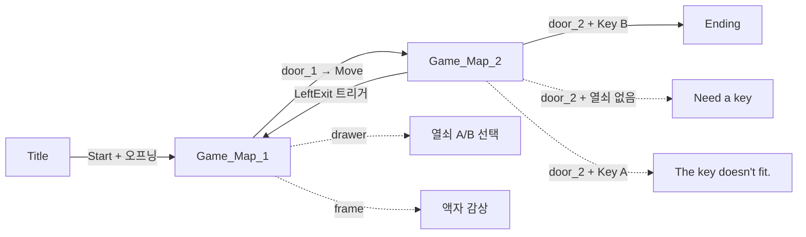
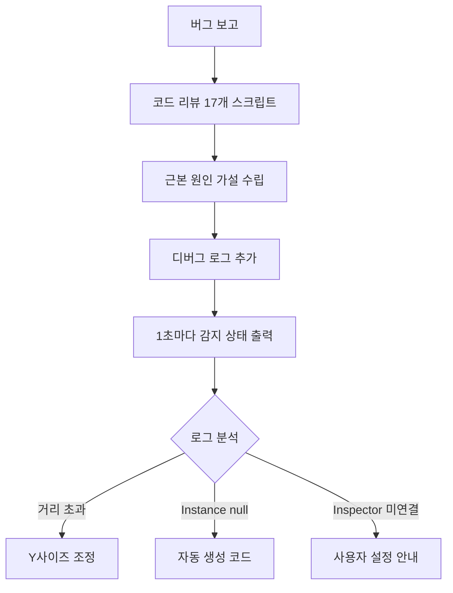
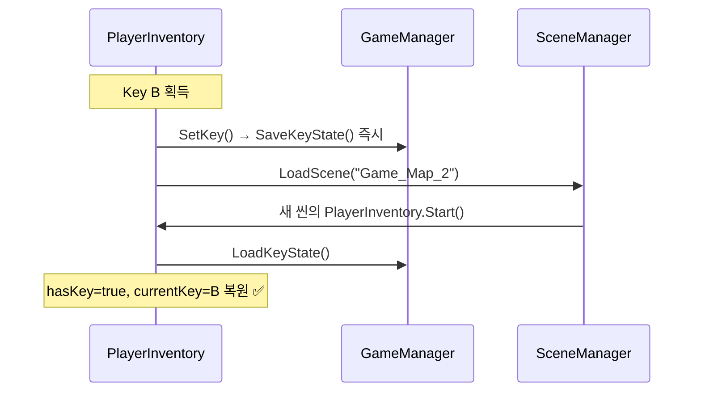

# Unity 2D 방탈출 게임 — 0.1.0 버전 개발 보고서

> **작업 기간**: 2026-02-16 ~ 2026-02-22  
> **엔진**: Unity 6.0.0.0  
> **이전 버전**: 0.0.1 → **현재 버전**: 0.1.0

---

## 📋 버전 목표

0.0.1에서 단일 맵 + 단일 문 구조였던 게임을 **멀티 씬 구조**로 확장:

- Title 씬 + 오프닝/엔딩 커트씬
- Game_Map_2 추가 (2개 맵 구성)
- frame(액자) 상호작용 추가
- door 확인 팝업(Yes/No) 추가
- 씬 간 플레이어 상태(열쇠) 유지

---

## 🎮 최종 게임 흐름



---

## 📊 씬 구성 변경

| 순서 | 씬 이름 | 0.0.1 | 0.1.0 | 변경 |
|------|---------|-------|-------|------|
| 0 | Title | ❌ | ✅ | **신규** |
| 1 | Game_Map_1 | ✅ 시작씬 | ✅ | door_1: Ending→Move, frame 추가 |
| 2 | Game_Map_2 | ❌ | ✅ | **신규** |
| 3 | Ending | ✅ | ✅ | 유지 |

---

## 📝 스크립트 변경 총괄 (18개)

### 신규 생성 (6개)

| 파일 | 위치 | 역할 |
|------|------|------|
| `CutsceneManager.cs` | _Core | 오프닝/엔딩 커트씬 재생 + 씬 전환 |
| `TitleManager.cs` | _Core | Title 씬 Start/Quit 버튼 |
| `FrameView.cs` | Game/Scripts | 액자 상호작용 → 패널 열기 |
| `FrameViewPanel.cs` | Game/Scripts | 액자 패널 UI (ESC 닫기, 이동 제어) |
| `DoorConfirmPopup.cs` | Game/Scripts | door_2 열쇠 사용 확인 팝업 |
| `MapExitTrigger.cs` | Game/Scripts | 맵 경계 트리거 → 씬 이동 |

### 수정 (6개)

| 파일 | 주요 변경 |
|------|-----------|
| `Door.cs` | Ending 타입에 confirmPopup 연동, Move 전 열쇠 상태 저장 |
| `PlayerInteraction.cs` | LayerMask 의존 제거 → 컴포넌트 기반 감지, FrameView 추가 |
| `GameManager.cs` | 열쇠 상태 Save/Load 추가, `[RuntimeInitializeOnLoadMethod]` 자동 생성 |
| `PlayerInventory.cs` | Start()에서 열쇠 복원, SetKey()에서 즉시 저장 |
| `GameTypes.cs` | DoorType에 Move 추가, 주석 업데이트 |
| `InteractionPromptUI.cs` | 기존 유지 (수정 없음) |

### 유지 (6개)

`PlayerMove2D.cs`, `Drawer.cs`, `KeySelectPopup.cs`, `MessageUI.cs`, `EndingManager.cs`, `InteractionPrompt.cs`

---

## 🔧 개발 과정 — Phase별 작업

### Phase 1: 계획 및 설계

- 0.1.0 구현 제안서 작성 (커트씬 관리 방식, 씬 구조, 스크립트 설계)
- **결정 사항**: 커트씬은 별도 씬이 아닌 기존 씬 내 오버레이 Canvas 방식 채택
- CutsceneManager.cs로 통합 관리 (재사용 가능)

### Phase 2: 코드 구현

**신규 스크립트 생성 순서:**
1. `CutsceneManager.cs` — Animator 기반 커트씬 재생 + 자동 씬 전환
2. `TitleManager.cs` — Start 클릭 시 CutsceneManager 호출, Quit 처리
3. `FrameView.cs` — viewPanel.SetActive(true)로 패널 표시
4. `FrameViewPanel.cs` — OnEnable/OnDisable로 이동 제어, ESC 닫기
5. `DoorConfirmPopup.cs` — Yes/No + 열쇠 검증 (correctKey 비교)
6. `MapExitTrigger.cs` — OnTriggerEnter2D로 씬 전환 + 열쇠 상태 저장

**기존 스크립트 수정:**
- `Door.cs`: Move 타입 추가, Ending 타입에 confirmPopup 연동
- `PlayerInteraction.cs`: FrameView 컴포넌트 감지 추가
- `GameManager.cs`: SaveKeyState/LoadKeyState 메서드 추가
- `PlayerInventory.cs`: 씬 시작 시 열쇠 복원 로직

### Phase 3: Unity Editor 설정 (사용자 수행)

- Title 씬 생성 (Canvas, 버튼, CutsceneManager)
- Game_Map_1 수정 (door_1→Move, frame에 FrameView 부착)
- Game_Map_2 씬 생성 (door_2, DoorConfirmPopup)
- Build Settings 업데이트 (4개 씬)

---

## 🐛 발견된 버그 및 해결 과정

### Bug 1: frame 근처에서 'E' 표시 안 됨

| 항목 | 내용 |
|------|------|
| **증상** | drawer, door는 E가 뜨지만 frame에서는 안 뜸 |
| **조사** | `PlayerInteraction`이 `LayerMask` 기반이라 Interactable 레이어 설정 또는 Collider 누락 의심 |
| **1차 수정** | LayerMask 의존 제거 → `Physics2D.OverlapCircleAll`로 모든 Collider 검색 후 컴포넌트 필터링 |
| **결과** | 여전히 안 됨 → 디버그 로그 추가 |
| **근본 원인** | frame이 벽에 걸린 액자라 Y=0.99 위치 → 바닥의 플레이어와 **거리 5.62** (반경 1.5 초과) |
| **최종 해결** | 사용자가 frame의 BoxCollider2D **Y 사이즈를 확장**하여 해결 ✅ |

### Bug 2: frame 상호작용 시 FrameViewPanel 안 열림

| 항목 | 내용 |
|------|------|
| **증상** | E키 눌러도 패널이 열리지 않음 |
| **근본 원인** | Inspector에서 `FrameView.viewPanel` 슬롯이 **None** |
| **해결** | 사용자가 FrameViewPanel 오브젝트를 드래그 연결하여 해결 ✅ |

### Bug 3: Key B를 가져도 door_2에서 "Need a key"

| 항목 | 내용 |
|------|------|
| **증상** | Game_Map_1에서 Key B 획득 → Game_Map_2 이동 → door_2 상호작용 시 "Need a key" |
| **근본 원인** | `GameManager` 오브젝트가 **씬에 배치되어 있지 않아** `Instance == null` → 열쇠 상태 저장/복원 전체 무효 |
| **1차 수정** | `PlayerInventory.SetKey()`에서 즉시 `GameManager.Instance.SaveKeyState()` 호출 |
| **2차 수정 (근본)** | `GameManager`에 `[RuntimeInitializeOnLoadMethod]` 추가 → **어느 씬에서 시작해도 자동 생성** |
| **결과** | 해결 ✅ |

### 디버깅 방법론



---

## 🏗️ 아키텍처 변경 사항

### 싱글톤 자동 생성 패턴 도입

```csharp
[RuntimeInitializeOnLoadMethod(RuntimeInitializeLoadType.BeforeSceneLoad)]
private static void AutoCreate()
{
    if (Instance == null)
    {
        GameObject go = new GameObject("GameManager");
        go.AddComponent<GameManager>();
    }
}
```

> Inspector에서 오브젝트를 배치하지 않아도 **어느 씬에서 시작하든** GameManager가 자동 생성됩니다.

### 상호작용 감지 방식 변경

| | 0.0.1 | 0.1.0 |
|--|-------|-------|
| **감지 방식** | LayerMask 기반 | 컴포넌트 기반 |
| **대상** | Interactable 레이어 오브젝트만 | Drawer, Door, FrameView 컴포넌트 보유 오브젝트 |
| **장점** | 빠른 필터링 | 레이어 설정 누락 방지, 확장 용이 |

### 열쇠 상태 영속성



---

## 📊 최종 코드 통계

| 항목 | 수치 |
|------|------|
| 총 스크립트 수 | 18개 |
| 신규 생성 | 6개 |
| 수정 | 6개 |
| 발견/해결 버그 | 3개 |
| 씬 수 | 4개 (Title, Game_Map_1, Game_Map_2, Ending) |

---

## ✅ 0.1.0 완료 기준 달성

| 기능 | 상태 |
|------|------|
| Title 씬 + Start/Quit | ✅ |
| 오프닝 커트씬 구조 | ✅ |
| Game_Map_2 + door_2 | ✅ |
| door_1 → Move 타입 (맵 이동) | ✅ |
| door_2 → Ending 타입 (확인 팝업) | ✅ |
| frame 상호작용 + FrameViewPanel | ✅ |
| 열쇠 상태 씬 간 유지 | ✅ |
| Game_Map_2 → Game_Map_1 복귀 | ✅ |
| GameManager 자동 생성 | ✅ |
| 디버그 로그 정리 | ✅ |

---

**0.1.0 버전 개발 완료! 🎉**
