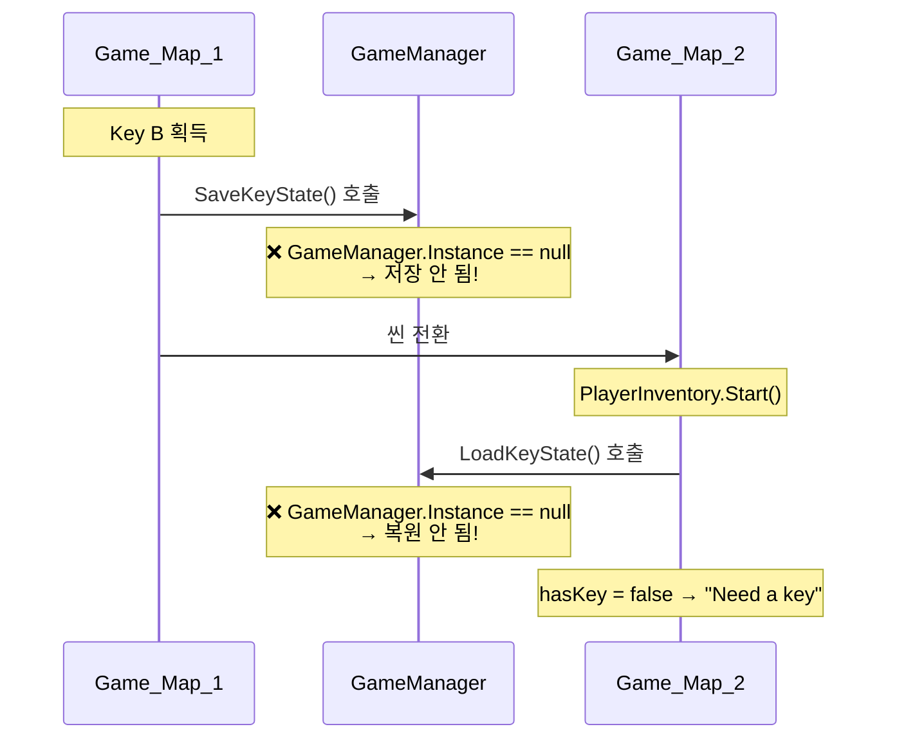

# 코드리뷰 요약 — 전체 스크립트 분석

## 스크립트 목록 (17개)

| 분류 | 파일 | 역할 |
|-----|------|------|
| Core | `GameManager.cs` | 싱글톤, DontDestroyOnLoad, 키 상태 저장/복원 |
| Core | `GameTypes.cs` | KeyType(A/B), DoorType(Move/Ending) enum |
| Core | `TitleManager.cs` | Start/Quit 버튼 처리 |
| Core | `CutsceneManager.cs` | 오프닝/엔딩 커트씬 재생 → 씬 전환 |
| Core | `EndingManager.cs` | 엔딩 씬에서 아무 키 → 게임 종료 |
| Core | `MessageUI.cs` | 화면 하단 메시지 표시 (싱글톤) |
| Core | `InteractionPromptUI.cs` | 오브젝트 위 [E] 표시 (싱글톤) |
| Player | `PlayerMove2D.cs` | A/D 키 좌우 이동 + 애니메이션 |
| Player | `PlayerInteraction.cs` | 주변 상호작용 감지 + E키 처리 |
| Player | `PlayerInventory.cs` | 열쇠 보유 상태 관리 |
| Game | `Drawer.cs` | 서랍 상호작용 → KeySelectPopup 열기 |
| Game | `KeySelectPopup.cs` | 열쇠 A/B 선택 UI |
| Game | `Door.cs` | Move/Ending 문 상호작용 |
| Game | `DoorConfirmPopup.cs` | 열쇠 사용 확인 Yes/No 팝업 |
| Game | `FrameView.cs` | 액자 상호작용 → FrameViewPanel 열기 |
| Game | `FrameViewPanel.cs` | 액자 상세 보기 패널 (ESC 닫기) |
| Game | `MapExitTrigger.cs` | 맵 경계 트리거 → 씬 이동 |

---

## 🔴 발견된 근본 원인 (Bug 1, 2, 3)

### Bug 1&2: frame 감지 안 됨 + E키 안 됨

**코드 자체는 정상**입니다. `PlayerInteraction.DetectInteractable()`이 `OverlapCircleAll`로 반경 내 모든 Collider2D를 검색하고, `FrameView` 컴포넌트를 찾도록 되어 있습니다.

#### 가능 원인 (Inspector 문제)

1. **`PlayerInteraction` 컴포넌트가 어디에 붙어있는지** 확인 필요
   - `player` 또는 `player_1` 중 하나에 있는데, `transform.position`이 실제 플레이어 위치와 다를 수 있음

2. **`InteractionPromptUI`의 `promptText` 슬롯**이 `Text_E`의 TMP에 연결되어 있는지 확인 필요
   - 연결 안 되면 `ShowAt()` 호출 시 NullReferenceException → 조용히 실패

3. **`FrameView`의 `viewPanel` 슬롯이 `None`** (스크린샷에서 확인됨)
   - `Interact()` 호출 시 `viewPanel.SetActive(true)` → NullReferenceException

> [!CAUTION]
> **frame Inspector 스크린샷에서 `View Panel: None (Game Object)` 확인됨.**
> `FrameViewPanel` 오브젝트를 연결해야 합니다.

### Bug 3: Key B 가져도 "Need a key" 표시

#### 근본 원인: `GameManager` 오브젝트가 씬에 없음

**해결 필요**: `GameManager` 오브젝트를 씬에 배치하거나 자동 생성 코드 추가

---

## 🟠 추가 발견 사항

| 항목 | 설명 |
|------|------|
| `FrameView.viewPanel` | None으로 되어있음 → `FrameViewPanel` 연결 필요 |
| `door_2` Ending 타입 확인 | `doorType = Ending`, `correctKey = B`, `playerInventory` 연결 확인 필요 |
| `InteractionPromptUI` | `promptText`가 `Text_E`의 TMP와 연결됐는지 확인 필요 |

---

## ✅ 수정 제안

### 1. `GameManager` 자동 생성 (코드 수정)
`GameManager`가 없으면 자동으로 생성하도록 수정 → Inspector 배치 없이 항상 동작 보장

### 2. `PlayerInteraction`에 디버그 로그 추가
감지 과정을 콘솔에서 확인할 수 있도록 임시 로그 추가

### 3. Inspector 연결 확인 체크리스트
- `FrameView.viewPanel` → `FrameViewPanel`
- `InteractionPromptUI.promptText` → `Text_E`의 TMP
- `door_2.playerInventory` → `player`의 `PlayerInventory`
